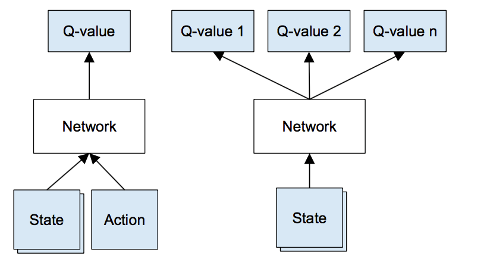

#Training a deep neural network to play a game

My project was training a convolutional neural network to play a simple flash based game called "Flappy Bird". The purpose of this project was to familiarize myself with using Google's Tensoflow package, and the concept of reinforcement learning. I followed the open git project by Yen Chen Lin at https://github.com/yenchenlin/DeepLearningFlappyBird. This tutorial will explain the concept of the learning process design, and usage of Tensorflow function in developing a network. In order to run the program, type `python gametest.py` inside the directory on terminal.

#Convolutional Neural Network

Convolutional neural network, or CNN, is a type of deep neural network that is commonly applied to analyzing visual imagery. CNNs requires less pre-processing than other image classification algorithms. The network learns the features of the image that are usually hand-egineered for traditional algorithms. This characteristics of CNN in feature design is a major advantage.

A CNN consists of an input layer, multiple hidden layers, and an output layer. The hidden layers of a CNN may be convolutional layers, activation functions (Common function is Rectified Linear Unit (RELU) function), max pooling layers, fully connected layers and normalization layers.

More detailed tutorials on convolutional neural network can be found in: https://towardsdatascience.com/a-comprehensive-guide-to-convolutional-neural-networks-the-eli5-way-3bd2b1164a53

#Reinforcement Learning

This project uses one class of reniforcement learning. Reinforcement learning is a learning design that's similar to Pavlov's Dog experiment, where dog was given rewards based on their action in repetitive manner. Reinforcement learning will generate a state where network makes a decision based on that state. The set of rules will decide whether the network received a positive reward or negative reward as a feedback. Based on the reward, the network will adjust it's values to make better decisions for the next state.

#DeepQLearning

Combining the reinforcement learning to CNN, comes the deep Q learning. In Q-learning, we define Q as a function $Q(s,a)$ which represents the maximum discounted future reward when the network performs action $a$ in the state $s$.

$$Q(s_t,a_t) = max R_{t+1}$$
In the context of this project, we can think of Q as best possible score from performing one action in certain game state. Now we just have to choose the action that yields the highest Q value for each state. Defining the Q function, we can use the Bellman Equation.
$$Q(s,a) = r + \gamma*max_{a'}Q(s',a')$$
Here, $s'$ is the one step future state and $a'$ is the one step future action. Logically, this function means maximum future reward for this state and action is the immediate reward plus maximum future reward for the next state.

We use CNN to implement this Q function.




Using the network, the framework of training process is as listed.

(Source:https://www.intel.ai/demystifying-deep-reinforcement-learning/#gs.ZVqWFqk6)

1. Do a feedforward pass for the current state s to get predicted Q-values for all actions.

2. Do a feedforward pass for the next state s??? and calculate maximum overall network outputs max a' $Q(s', a')$.

3. Set Q-value target for action to $r + \gamma max_{a'}Q(s', a')$ (use the max calculated in step 2). For all other actions, set the Q-value target to the same as originally returned from step 1, making the error 0 for those outputs.

4. Update the weights using backpropagation.


#Setting up a network using Tensorflow

We can think of tensorflow as a package that makes building a neural network lot easier than doing it without such tools. Lets walk through some examples.

First we want to install tensorflow.

```{bash, eval=FALSE}
pip install python
```

This should do the work of installing.

The following codes is used to build a network described in the given image. This network is the DeepMind team's classical convolutional neural network.

```{python, eval=FALSE, python.reticulate = FALSE}
import tensorflow as tf

def conv2d(x, weights, stride):
    return tf.nn.conv2d(x, weights, strides = [1, stride, stride, 1], padding = "SAME")

def max_pool_2x2(x):
    return tf.nn.max_pool(x, ksize = [1, 2, 2, 1], strides = [1, 2, 2, 1], padding = "SAME")

def createNetwork():
    # network weights
    weights_conv1 = tf.Variable(tf.truncated_normal(shape = [8, 8, 4, 32], stddev = 0.01))
    bias_conv1 = tf.Variable(tf.constant(0.01, shape = [32]))

    weights_conv2 = tf.Variable(tf.truncated_normal(shape = [4, 4, 32, 64], stddev = 0.01))
    bias_conv2 = tf.Variable(tf.constant(0.01, shape = [64]))

    weights_conv3 = tf.Variable(tf.truncated_normal(shape = [3, 3, 64, 64], stddev = 0.01))
    bias_conv3 = tf.Variable(tf.constant(0.01, shape = [64]))

    weights_fc1 = tf.Variable(tf.truncated_normal(shape = [1600, 512], stddev = 0.01))
    bias_fc1 = tf.Variable(tf.constant(0.01, shape = [512]))

    weights_fc2 = tf.Variable(tf.truncated_normal(shape = [512, 2], stddev = 0.01))
    bias_fc2 = tf.Variable(tf.constant(0.01, shape = [2]))

    # input layer
    s = tf.placeholder("float", [None, 80, 80, 4])

    # hidden layers
    h_conv1 = tf.nn.relu(conv2d(s, weights_conv1, 4) + bias_conv1)
    h_pool1 = max_pool_2x2(h_conv1)

    h_conv2 = tf.nn.relu(conv2d(h_pool1, weights_conv2, 2) + bias_conv2)

    h_conv3 = tf.nn.relu(conv2d(h_conv2, weights_conv3, 1) + bias_conv3)

    h_conv3_flat = tf.reshape(h_conv3, [-1, 1600])

    h_full_connect1 = tf.nn.relu(tf.matmul(h_conv3_flat, weights_fc1) + bias_fc1)

    # readout layer
    Q = tf.matmul(h_full_connect1, weights_fc2) + bias_fc2

    return s, Q
```


Source: https://github.com/yenchenlin/DeepLearningFlappyBird 


```{python, eval=FALSE, python.reticulate = FALSE}
def conv2d(x, weights, stride):
    return tf.nn.conv2d(x, weights, strides = [1, stride, stride, 1], padding = "SAME")
```

This function computes a 2-D convolution given 4-D input and filter tensors.

```{python, eval=FALSE, python.reticulate = FALSE}
def max_pool_2x2(x):
    return tf.nn.max_pool(x, ksize = [1, 2, 2, 1], strides = [1, 2, 2, 1], padding = "SAME")
```

This function performs the max pooling on the input with stride 2.

```{python, eval=FALSE, python.reticulate = FALSE}
weights_conv1 = tf.Variable(tf.truncated_normal(shape = [8, 8, 4, 32], stddev = 0.01))
bias_conv1 = tf.Variable(tf.constant(0.01, shape = [32]))
```

These set of function works as initializers for weight matrix and bias vector. `tf.truncated_normal()` Outputs random values from a truncated normal distribution. `tf.Variable()` creates a placeholder for the variable to be store throughout the training process.

```{python, eval=FALSE, python.reticulate = FALSE}
h_full_connect1 = tf.nn.relu(tf.matmul(h_conv3_flat, weights_fc1) + bias_fc1)
```

`tf.nn.relu()` is the activation function ReLU. It assigns 0 for negative values and leave as is for positive values.
`tf.matmul()` will apply matrix multiplication to make the ouput a fully connected layer.

```{python, eval=FALSE, python.reticulate = FALSE}
`Q = tf.matmul(h_full_connect1, weights_fc2) + bias_fc2`
```

This equation will compute the vector that contains Q score for each actions.

```{python, eval=FALSE, python.reticulate = FALSE}
def playGame():
    sess = tf.InteractiveSession()
    s, Q = createNetwork()
    train(s, Q, sess)
```

Above is the function I used to run the training process. `tf.InteractiveSession()` creates a new interactive TensorFlow session.

`createNetwork()` is a function we saw above that constructed the network.

`train(s, Q, sess)` is a function I used for training. The detailed codes can be found in gametest.py file provided.

Inside the `train(s, Q, sess)`, we can also find some use of tensorflow package.

```{python, eval=FALSE, python.reticulate = FALSE}
def train(s, Q, sess):
    a = tf.placeholder("float", [None, 2])
    y = tf.placeholder("float", [None])
    Q_action = tf.reduce_sum(tf.multiply(Q, a), reduction_indices = 1)
    cost = tf.reduce_mean(tf.square(y - Q_action))
    train_step = tf.train.AdamOptimizer(learning_rate = 1e-6).minimize(cost)
    
    [SOME OTHER CODES]
    
    while(True):
      [SOME OTHER CODES]
      train_step.run(feed_dict = {y : y_batch, a : action_batch, s : s_j_batch})
```

`a = tf.placeholder("float", [None, 2])` creates a placeholder for actions to be stored in that is tensorflow network compatible.

Tensorflow also provides arithmetic functions such as reduce_sum, reduce_mean, square, and multiply.

`Q_action = tf.reduce_sum(tf.multiply(Q, a), reduction_indices = 1)` and `cost = tf.reduce_mean(tf.square(y - Q_action))` is used to set up the cost function for Q-learning.

`train_step = tf.train.AdamOptimizer(learning_rate = 1e-6).minimize(cost)` sets the optimizing methods to be AdamOptimizer with learning rate of 1e-6. AdamOptimizer is very commonly used optimizer for neural network. This optimizer will now minimize the cost function.

So each run of `train_step.run(feed_dict = {y : y_batch, a : action_batch, s : s_j_batch})` will train the network by using AdamOptimizer.


#Batch learning

The network trains on mini batch of size 32 instead of the full dataset for each run. This allows to reduce calculation time.

#Injecting Random Action

Thinking intuitively, we learn much more from new experiences than the usual experiences. In effort to apply this concept into network training, we force the network to try random actions once in a while, especially in the early stage of learning. Therefore I set the probability of bird performing a random action as 0.1 and slowly decreased it down to 0.0001 over 2 million time frame. This will stimulate training by injecting in random actions, which can function as the "new experience".

#Analysis of learning pattern

After about 3 million timeframe, the neural net seem to converge, or "master the game". But given the characteristic of reinforcement learning in general, any decent network is assumed to converge after some time. Then the question arises whether we can compare different networks' performance. One possible answer is comparing two networks based on there learning patterns, or speed. `gametest.py` will save the time until failures and export it as `time_to_fail.csv` every 10,000 time frame. Plotting these shows the learning pattern of DeepMinds' network. We can see that loess curve starts to rise exponentially after 2 million training step.

```{r}
library(ggplot2)
time_to_fail <- read.csv("time_to_fail.csv")
colnames(time_to_fail) <- c("X", "TimeAtFail")

time_to_fail$TimeToFail <- c(0,diff(time_to_fail$TimeAtFail))


ggplot(data = time_to_fail, aes(x=TimeAtFail, y=TimeToFail)) + 
  geom_point(alpha = 0.5) +
  geom_smooth(se = FALSE, col = "red") +
  labs(title = "Time Until Failure vs. Time at Failure")
```

#Future Application

After understanding the concept of deep Q learning, applying this methods to train on other game is also possible. Take, for example, a famous game Mario. Mario has 4 possible actions: Left, Right, Jump, and Duck. We can train the network to play Mario by changing the dimension of the Q vector to have Q-scores for each actions in Mario. Other games like StarCraft, or any games that require mouse input may be harder. The number of possible actions will be extremely large, leading to high computational costs, thus requiring to train on multiple GPUs or server.

#Sources

This project was inspired by Yen Chen Lin's open source project at https://github.com/yenchenlin/DeepLearningFlappyBird

